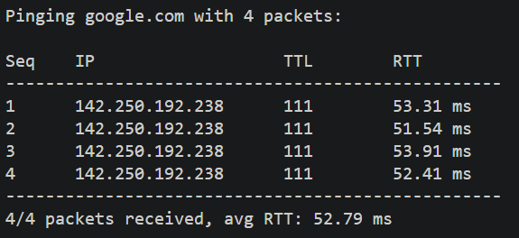
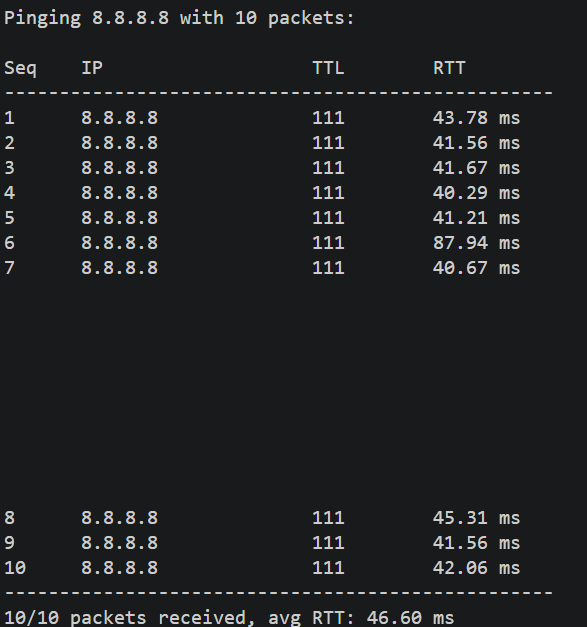

# NetProbe - CLI Network Diagnostic Tool

Ever wondered how `ping` and `traceroute` actually work under the hood? how they're built?

Before writing a single line of code, I had no idea where to even start with 
network programming. Found Beej's Guide to Network Programming online — read 
through it, understood how sockets work at a low level, and then built this.

## What it does

- **Ping** — sends ICMP echo requests to a host, measures round-trip latency 
  and packet loss
- **Traceroute** — discovers every router hop between source and a destination 
  by manipulating IP TTL values

## Why C++

Raw socket programming means  constructing packets at the byte level —
manually filling ICMP headers, computing checksums, managing file descriptors.
That's inherently a systems-level task. C++ is the natural fit for it.

## Stack

- **Language:** C++17
- **Networking:** POSIX raw sockets (`SOCK_RAW`), ICMP protocol
- **Build system:** CMake
- **Platform:** Linux (raw sockets require root privileges)

## Installation

```bash
# Clone the repo or Fork it first.
git clone https://github.com/ankurO7/netprobe.git
cd netprobe
```

## Build

```bash
mkdir build && cd build
cmake ..
make
```

## Usage

```bash
sudo ./netprobe ping google.com
sudo ./netprobe ping 8.8.8.8 10
sudo ./netprobe trace google.com
```
## Sample Output

### Ping


/------------------------/


### Traceroute

*Turns out traceroute is a little too good at its job 
and reveals my ISP, location. Try it yourself.*

## What I learned building this

- How ICMP packets are structured at the byte level
- Why raw sockets require root — you're bypassing the OS networking stack
- The TTL trick behind traceroute — every router decrements TTL by 1,
  and sends back its IP when it hits 0. That's your hop.
- Checksum calculation — if it's wrong, packets are silently dropped.
  No error, just silence. Fun to debug.
- Reverse DNS resolution to turn hop IPs into readable hostnames

## Reference

- [Beej's Guide to Network Programming](https://beej.us/guide/bgnet/)

